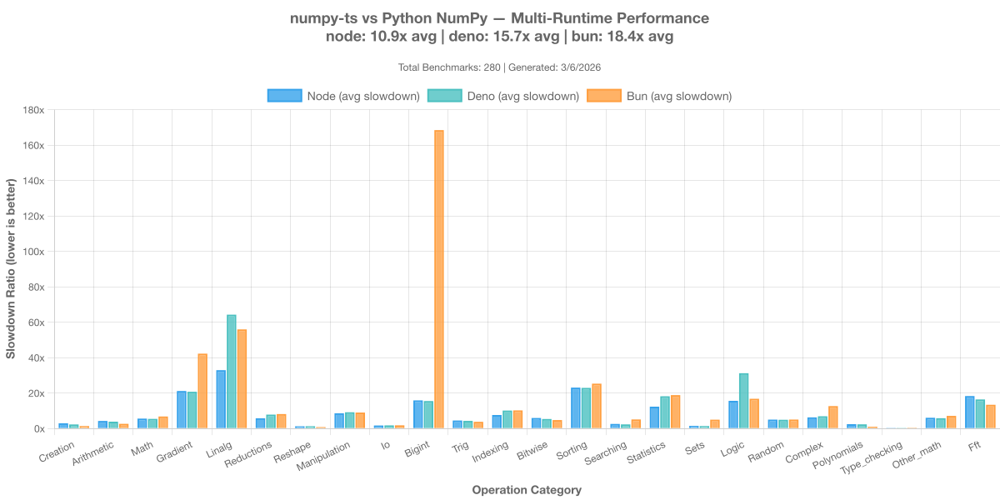

# numpy-ts


[](https://www.npmjs.com/package/numpy-ts)


```
███╗   ██╗██╗   ██╗███╗   ███╗██████╗ ██╗   ██╗  ████████╗███████╗
████╗  ██║██║   ██║████╗ ████║██╔══██╗╚██╗ ██╔╝  ╚══██╔══╝██╔════╝
██╔██╗ ██║██║   ██║██╔████╔██║██████╔╝ ╚████╔╝█████╗██║   ███████╗
██║╚██╗██║██║   ██║██║╚██╔╝██║██╔═══╝   ╚██╔╝ ╚════╝██║   ╚════██║
██║ ╚████║╚██████╔╝██║ ╚═╝ ██║██║        ██║        ██║   ███████║
╚═╝  ╚═══╝ ╚═════╝ ╚═╝     ╚═╝╚═╝        ╚═╝        ╚═╝   ╚══════╝
```

Complete NumPy implementation for TypeScript and JavaScript

**⚠️ Under active development** — API may change before v1.0

```bash
npm install numpy-ts
```

## Why numpy-ts?

- **📊 Extensive API** — **291 of 333 NumPy functions (87.4% coverage)**
- **✅ NumPy-validated** — 2000+ test cases cross-validated against Python NumPy
- **🔒 Type-safe** — Full TypeScript support with shape and dtype inference
- **🌐 Universal** — Works in Node.js and browsers with .npy/.npz file support
- **🎯 Zero dependencies** — Pure TypeScript, no heavy external libraries

## Quick Start

```typescript
import * as np from 'numpy-ts';

// Array creation with dtype support
const A = np.array([[1, 2], [3, 4]], 'float32');
const B = np.ones([2, 2], 'int32');

// Broadcasting and chained operations
const result = A.add(5).multiply(2);

// Linear algebra
const C = A.matmul(B);
const trace = A.trace();

// Reductions with axis support
const colMeans = A.mean(0);  // [2.0, 3.0]

// NumPy-style slicing with strings
const row = A.slice('0', ':');    // A[0, :]
const submatrix = A.slice('0:2', '1:');  // A[0:2, 1:]
```

## Features

### API Coverage

Progress toward complete NumPy API compatibility:

| Category | Complete | Total | Status |
|----------|----------|-------|--------|
| **Arithmetic** | 19/19 | 100% | ✅ |
| **Array Creation** | 32/32 | 100% | ✅ |
| **Bit Operations** | 9/9 | 100% | ✅ |
| **Broadcasting** | 3/3 | 100% | ✅ |
| **Comparison** | 10/10 | 100% | ✅ |
| **Exponential** | 9/9 | 100% | ✅ |
| **Gradient** | 4/4 | 100% | ✅ |
| **Hyperbolic** | 6/6 | 100% | ✅ |
| **I/O** | 8/8 | 100% | ✅ |
| **Indexing** | 20/20 | 100% | ✅ |
| **Linear Algebra** | 9/9 | 100% | ✅ |
| **Linear Algebra (linalg)** | 19/19 | 100% | ✅ |
| **Logic** | 12/12 | 100% | ✅ |
| **Random** | 17/17 | 100% | ✅ |
| **Reductions** | 30/30 | 100% | ✅ |
| **Rounding** | 7/7 | 100% | ✅ |
| **Searching** | 6/6 | 100% | ✅ |
| **Set Operations** | 7/7 | 100% | ✅ |
| **Sorting** | 6/6 | 100% | ✅ |
| **Statistics** | 9/9 | 100% | ✅ |
| **Trigonometric** | 12/12 | 100% | ✅ |
| **Array Manipulation** | 35/41 | 85% | 🟡 |
| **FFT** | 0/18 | 0% | 🔴 |
| **Other Math** | 0/11 | 0% | 🔴 |
| **Unplanned** | 0/7 | 0% | 🔴 |

**Overall: 291/333 functions (87.4% complete)**

See the complete [API Reference](docs/API-REFERENCE.md) for detailed function list.

### Data Types (dtypes)

NumPy-compatible type system with automatic promotion:

| DType | NumPy | numpy-ts | Notes |
|-------|-------|----------|-------|
| **Floating Point** ||||
| `float64` | ✅ | ✅ | Default dtype |
| `float32` | ✅ | ✅ | |
| `float16` | ✅ | ⚠️ | Planned (waiting for [this](https://developer.mozilla.org/en-US/docs/Web/JavaScript/Reference/Global_Objects/Float16Array)) |
| **Signed Integers** ||||
| `int64` | ✅ | ✅ | Uses BigInt |
| `int32` | ✅ | ✅ | |
| `int16` | ✅ | ✅ | |
| `int8` | ✅ | ✅ | |
| **Unsigned Integers** ||||
| `uint64` | ✅ | ✅ | Uses BigInt |
| `uint32` | ✅ | ✅ | |
| `uint16` | ✅ | ✅ | |
| `uint8` | ✅ | ✅ | |
| **Other Numeric** ||||
| `bool` | ✅ | ✅ | Stored as uint8 |
| `complex64` | ✅ | ❌ | Not yet supported |
| `complex128` | ✅ | ❌ | Not yet supported |
| **Non-Numeric** ||||
| `str_` | ✅ | ❌ | Not planned |
| `bytes_` | ✅ | ❌ | Not planned |
| `object_` | ✅ | ❌ | Not planned |
| `datetime64` | ✅ | ❌ | Future consideration |
| `timedelta64` | ✅ | ❌ | Future consideration |

**Supported: 11/20 numeric dtypes** • Complex and temporal types planned for future releases

### NumPy Memory Model

- **View tracking** — `base` attribute and `OWNDATA` flag
- **Strided arrays** — C/F contiguous flags for memory layout
- **Zero-copy ops** — Views for slicing, transpose, reshape (when possible)

```typescript
const arr = np.ones([4, 4]);
const view = arr.slice('0:2', '0:2');

console.log(view.base === arr);      // true - view tracks base
console.log(view.flags.OWNDATA);     // false - doesn't own data
console.log(arr.flags.C_CONTIGUOUS); // true - row-major layout
```

## Architecture

```
┌─────────────────────────────────┐
│  NumPy-Compatible API           │
│  Broadcasting, DType Promotion  │
└───────────────┬─────────────────┘
                │
┌───────────────┴─────────────────┐
│  NDArray (Views & Memory Mgmt)  │
│  Strided Arrays, Base Tracking  │
└───────────────┬─────────────────┘
                │- - - - - - - - - - - - - - - - - - ┐  
┌───────────────┴─────────────────┐  ┌ ─ ─ ─ ─ ─ ─ ─ ┴ ─ ─ ─ ─ ─ ─ ─ ─┐
│  TypeScript / JavaScript Core   │  │  WASM Compute Engine (Future)  │
│  Computational Engine           │  │  Optimized BLAS / arithmetic   │
└─────────────────────────────────┘  └ ─ ─ ─ ─ ─ ─ ─ ─ ─ ─ ─ ─ ─ ─ ─ ─┘
```

Pure TypeScript implementation built from scratch for correctness and NumPy compatibility.

## Performance



See [benchmarks/README.md](benchmarks/README.md) for detailed performance analysis.

## File I/O

Read and write `.npy` and `.npz` files with Node.js or browsers.

### Node.js

```typescript
import { load, save, savez, savez_compressed } from 'numpy-ts/node';

save('array.npy', arr);
const arr = load('array.npy');

savez('arrays.npz', { a: arr1, b: arr2 });
const { a, b } = load('arrays.npz');
```

### Browser

```typescript
import * as np from 'numpy-ts';

// Parse fetched .npy file
const response = await fetch('array.npy');
const arr = np.parseNpy(await response.arrayBuffer());

// Serialize for download
const bytes = np.serializeNpy(arr);
```

*Why separate imports?* The `/node` entry includes Node.js `fs` usage. Keeping it separate ensures browser bundles stay clean.

## Examples

### Broadcasting

```typescript
const matrix = np.ones([3, 4]);     // (3, 4)
const row = np.arange(4);           // (4,)
const result = matrix.add(row);     // (3, 4) - row broadcast to each row

const col = np.array([[1], [2], [3]]);  // (3, 1)
const grid = col.multiply(row);         // (3, 4) - outer product via broadcasting
```

### Slicing

TypeScript doesn't support Python's `arr[0:5, :]`, so we use strings:

```typescript
arr.slice('0:5', '1:3');     // arr[0:5, 1:3]
arr.slice(':', '-1');        // arr[:, -1]
arr.slice('::2');            // arr[::2]

// Convenience helpers
arr.row(0);                  // arr[0, :]
arr.col(2);                  // arr[:, 2]
```

### Type Safety

```typescript
const arr = np.zeros([3, 4]);  // Type: NDArray<Float64>
arr.shape;  // Type: readonly [3, 4]
arr.sum();  // Type: number
```


## Comparison with Alternatives

| Feature | numpy-ts | numjs | ndarray | TensorFlow.js |
|---------|----------|-------|---------|---------------|
| NumPy API Coverage | 291/333 (87%) | ~20% | Different | ML-focused |
| TypeScript Native | ✅ Full | Partial | ❌ No | ✅ Yes |
| NumPy Validated | ✅ 1365+ tests | Mostly | ❌ No | ❌ No |
| .npy/.npz Files | ✅ v1/v2/v3 | ❌ No | ❌ No | ❌ No |
| Broadcasting | ✅ Full | Limited | Limited | ✅ Full |
| Bundle Size | <50kb | ~60kb | ~5kb | >100kb |

## Contributing

Contributions welcome! See [CONTRIBUTING.md](CONTRIBUTING.md) for detailed instructions on:

- Setting up the development environment
- Adding new functions with tests
- Running benchmarks
- Submitting pull requests

## Documentation

- **[API Reference](docs/API-REFERENCE.md)** — Complete function checklist (120+ functions)
- **[Feature Details](docs/FEATURES.md)** — Broadcasting, dtypes, views, slicing
- **[Contributing Guide](CONTRIBUTING.md)** — How to contribute
- **[Testing Guide](docs/TESTING-GUIDE.md)** — Testing strategy and examples
- **[Architecture](docs/ARCHITECTURE.md)** — System design and internals


## License

[MIT License](LICENSE) — Copyright (c) 2025 Nicolas Dupont

---

**Bring NumPy to TypeScript!** ⭐
[GitHub](https://github.com/dupontcyborg/numpy-ts) • [Issues](https://github.com/dupontcyborg/numpy-ts/issues) • [NumPy Docs](https://numpy.org/)
